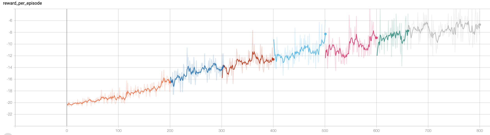

**Vanilla Policy Gradient(REINFORCE)**

**Setup**

Create Virtual Environment

`pip` //Todo

Install dependencies

`pip install -r requirements.txt`

Try it out

`python VanillaPolicyGradient/src/play.py`

 to get checkpoints see below

Train Model

`python VanillaPolicyGradient/src/train.py`

**Progress of the agent**

**__After 1000 episodes__**

**__After 2500 episodes__**

**__After 5000 episodes__**

**Rewards Progress through episodes**

**Download Model**

https://drive.google.com/file/d/1wGLJD73Z_IIAtp35TmhiW9yeBhYr70ek/view?usp=sharing

rename the file to `model.pt` and put it in `VanillaPolicyGradient/checkpoints/`
